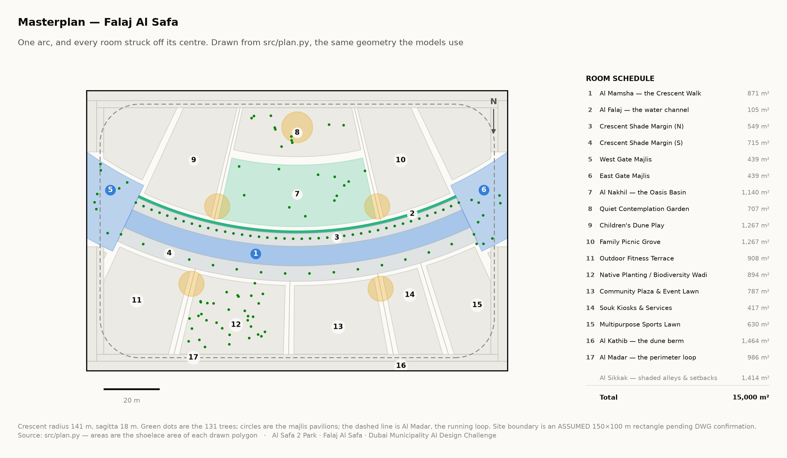

# Al Safa 2 Park — explained simply

This is the **only file in this folder**. It exists so you can understand your
own project in five minutes, without opening any code.

---

## 1. What is this, in one sentence?

Dubai Municipality is running a design competition. You are redesigning a real
15,000 m² neighbourhood park (Al Safa 2) so it's actually usable in the heat.
1st prize is AED 100,000. **You submit by 15 August 2026 — 12 days from today.**

---

## 2. The design — what you are actually proposing

Forget the files for a second. Here is the design, in plain words:

> **One curved, shaded walkway — shaped like a crescent moon — sweeps across the
> park. A shallow water channel runs along its shaded edge. Every other part of
> the park (playground, picnic lawn, gardens, plaza, fitness area) is arranged
> like slices of a pie, all pointing toward the centre of that curve.**

That's the whole idea. Everything else in this project — every chart, every
model, every report — exists to either **design that curve correctly** or
**prove it works**.

Here is the actual masterplan, generated from the real measurements:

The named parts:

| Name | What it is |
|---|---|
| **Al Hilal** | the crescent canopy — the shaded curved walkway itself |
| **Al Falaj** | the water channel, running along the shaded edge |
| **Al Nakhil** | a sunken palm court, tucked in the cool inner curve |
| **Al Sikkak** | the small side-alleys, all radiating from the same centre |
| **Al Madar** | the outer running loop, tree-shaded but open-air |
| **Al Kathib** | a planted earth mound along the road, for noise/heat/glare |

**Why a curve and not a straight path?** A straight shaded path only blocks the
sun well from one direction. When the sun comes from a bad angle, the *entire*
path loses its shade at once. A curve is always angled well *somewhere* along
its length, so there's almost never a moment with nowhere shaded to stand. That
was tested against a full year of sun-position data, not guessed.

**Does it work?** Today the park is comfortable to stand in about **44.5%** of
daylight hours. As redesigned: **64.6%**. Under the canopy itself, temperature
"feels like" drops by about **7°C**.

---

## 3. About the pictures that looked wrong to you

**You were right to be suspicious.** Here's exactly what happened:

Earlier versions of this project generated AI photo-renders that did **not**
match the crescent design above — one showed a straight corridor, one an S-curve,
one a lagoon. Someone caught the mismatch and deleted all of them rather than
submit pictures of a park that isn't the one being proposed.

So right now, **`design/renders/` is genuinely empty.** That's not a bug you're
missing — it's the truth of where the project is. The park has **no finished
photo-pictures yet.** The correct prompts to generate new, accurate ones (that
actually match the curve, the water channel, the desert trees) are already
written and waiting in `RENDER_PROMPTS.md`. Generating them is the single
biggest thing left to do.

---

## 4. The 10 phases — how the design got built

This is the actual step-by-step process behind the design, in order:

| # | Phase | What happened | In one line |
|---|---|---|---|
| 1 | Site & Context | Studied the existing park, climate, sun path, who lives nearby | Found out *why* the park is hard to use today |
| 2 | Problem Definition | Listed every problem, ranked by severity | Heat is by far the biggest problem |
| 3 | Opportunity & Objectives | Turned problems into measurable targets | Set the comfort-hours goal the design is judged against |
| 4 | Concept Development | Sketched several ideas, scored them, picked one | The crescent canopy won |
| 5 | Masterplan Development | Laid out every room around the crescent's centre | Produced the masterplan picture above |
| 6 | Detailed Design | Solved the shade structure's exact shape and height | 7 m walk, 18 m canopy, a southern sun-blocking fin |
| 7 | Performance & Sustainability | Checked water, carbon, solar power, shade by zone | Confirmed the design actually performs |
| 8 | User Experience & Activation | Worked out when/where people will actually use it | Programmed for late afternoon, spring & autumn |
| 9 | AI Workflow & Visualization | Documented how AI was used; built renders & film | The competition's "how did AI help" answer |
| 10 | Submission Assembly | Packaged everything into the 12 required upload files | What now sits in `submission/` |

Full detail on each phase, if you ever want it, is in `archive/phases/`
(folders `01_` through `10_`) — but you don't need to open those to understand
the project.

---

## 5. Why the main folder looks so busy

Most of what's in the project folder isn't "the design" — it's the **proof**
behind the design, kept so a judge (or you) can check every number is real and
not made up. You personally only ever need to open **four things**:

| | |
|---|---|
| `PROJECT_PLAN.md` | the full, detailed version of this explanation |
| `00_BRIEF/` | what Dubai Municipality actually asked for |
| `RENDER_PROMPTS.md` | the instructions for generating the missing pictures |
| `UPLOAD_THESE_12_FILES/` | the 12 finished PDFs you will actually submit |

Everything else (`src/`, `data/`, `models/`, `tests/`, `figures/`, `docs/`) is
machinery that *produces* those four things. You don't need to understand it
any more than you need to understand a printing press to read a book.

---

## 6. What's actually left before 15 August

**Already done:** the design itself, the cost budget check, the compliance
items Dubai Municipality requires, all 12 submission PDFs assembled, all the
reports rewritten to match the crescent design, all analysis and testing.

**Still open — and only a human can close these:**

1. **Generate the missing renders** using `RENDER_PROMPTS.md` (biggest gap — see §3 above)
2. **Confirm the real park boundary** by opening the official site drawing in `00_BRIEF/`
3. **Read the written reports and approve them** — they're AI-assisted drafts; the final judgement is yours
4. **Record the 60-second concept video** (optional, but the public gets to vote)
5. **Publish the project online and add the links** to the submission (optional, but strengthens the "AI" scoring criterion)
6. **Submit before 15 August 2026** and tick the 4 required declarations

That's it. The design is not broken and the project is not "collapsed" — it's
a finished, coherent design that is missing its final photographs and a human
sign-off.
