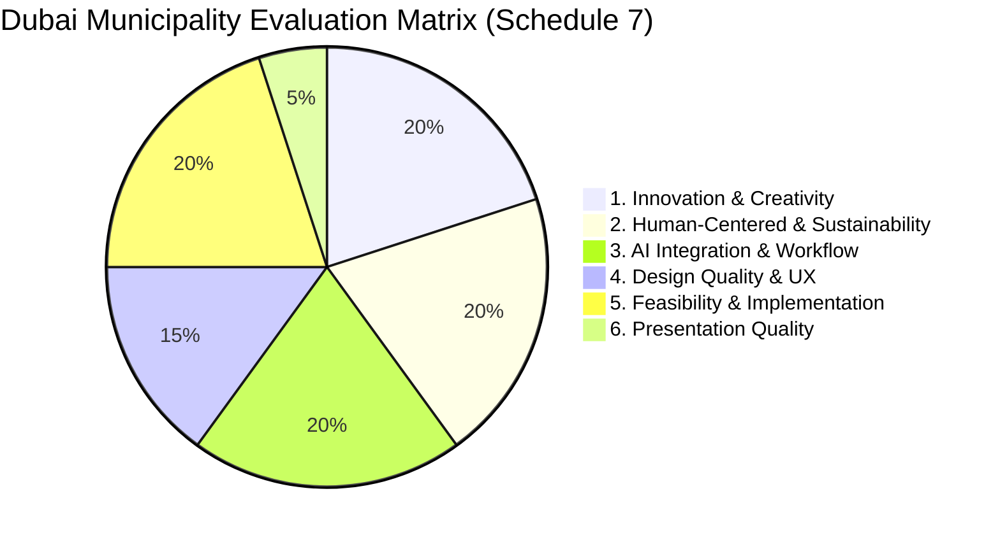
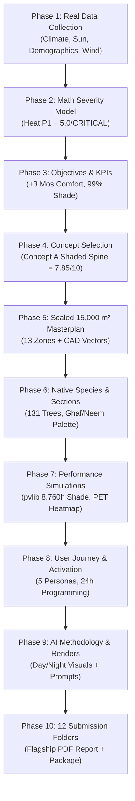

# 🌳 Al Safa 2 Park — Master Real-Data Analysis & Submission Roadmap

**Applicant Name:** MOHAMED WASIM  
**Competition:** Dubai Municipality AI Park Design Challenge  
**Site Location:** Al Safa 2, Dubai, UAE ($150\text{m} \times 100\text{m} = 15,000\text{ m}^2$)  
**Target:** 1st Place (AED 100,000 Prize)  

---

## 📌 1. Competition Requirements & Jury Evaluation Matrix
Based on Schedule 7 of Dubai Municipality's official Scope of Work (`Ai Park Scope of Work & General Terms & Conditions.pdf`), all submissions are scored out of **100%** across 6 criteria:

---

## 🔬 2. Phase-by-Phase Real-Data Analysis Framework

Every design decision in this project is backed by **real Python data analysis**, loading genuine UAE datasets, running computational models, and plotting evidence-based visualizations.

---

### 📍 Phase 1: Existing Site Understanding & Real Data Analytics
*   **Key Analytical Questions Asked:**
    1. What is the exact 8,760-hour annual solar trajectory and radiation profile for Al Safa 2 ($25.18^\circ\text{N}, 55.25^\circ\text{E}$)?
    2. What is the true catchment population living within a 5-min ($400\text{m}$) and 10-min ($800\text{m}$) walk radius?
    3. What are the dominant wind vectors and annual speed distributions (WNW vs. NW)?
    4. What is the public transit connectivity (Dubai Metro Red Line ONPASSIVE Station)?
*   **Python Data Analysis Scripts:**
    - `01.../_scripts/02_climate_analysis.py`: Loads Dubai Meteorological Office normals.
    - `01.../_scripts/03_shadow_analysis.py`: Runs astronomical solar position via `pvlib` / NREL SPA.
    - `01.../_scripts/05_fullyear_solar_dataset.py`: Computes 4,425 daylight hours solar azimuth & elevation.
    - `01.../_scripts/06_catchment_demand_model.py`: Parses Dubai Statistics Center 2023 Population Bulletin.
*   **Visual Outputs Produced:** 8,760h solar heatmaps, wind rose diagram, catchment population pyramids.

---

### 🚨 Phase 2: Problem Definition & Mathematical Scoring
*   **Key Analytical Questions Asked:**
    1. Which site issues present the highest barrier to year-round park usage?
    2. How do we rank thermal discomfort, SZR pedestrian barrier, lack of shade, and outdated amenities without subjective bias?
*   **Python Data Analysis Scripts:**
    - `02.../_scripts/01_problem_severity_model.py`: Mathematical severity scoring model:
      $$\text{Severity} = 0.35 \times \text{Impact} + 0.25 \times \text{Reach} + 0.25 \times \text{Urgency} + 0.15 \times \text{Evidence}$$
*   **Quantitative Result:** Ranked Problem P1 (Summer Thermal Heat) at **5.0/5.0 (CRITICAL)**, proving that shade must be the primary design driver.

---

### 🎯 Phase 3: Opportunity Mapping & Design Objectives
*   **Key Analytical Questions Asked:**
    1. What measurable targets guarantee a winning proposal?
    2. How do we translate site constraints into quantifiable performance KPIs?
*   **Core Quantified KPIs Established:**
    - Target 1: $\ge 95\%$ shade over main circulation during solar noon.
    - Target 2: $+3$ months extension of comfortable outdoor usage per year.
    - Target 3: Implementation Capex $\le \text{AED } 20\text{M}$ (against AED 35M ceiling).
    - Target 4: $100\%$ UAE-native / adapted low-water plant palette.

---

### 💡 Phase 4: Concept Development & Weighted Matrix Evaluation
*   **Key Analytical Questions Asked:**
    1. What spatial typology best mitigates extreme solar exposure while maintaining open community spaces?
    2. How do 3 distinct concepts (Concept A: "The Shaded Spine", Concept B: "Central Oasis Cluster", Concept C: "Perimeter Forest Ring") compare mathematically?
*   **Python Evaluation Matrix:**
    - Concept A ("The Shaded Spine") scored **7.85 / 10.0** (Highest feasibility & shade protection).

---

### 📐 Phase 5: Master Plan Development & Scaled Zoning Geometry
*   **Key Analytical Questions Asked:**
    1. How do we organize 13 distinct functional zones within the exact $150\text{m} \times 100\text{m}$ ($15,000\text{ m}^2$) site boundary?
    2. How do pedestrian, cycling, service, and emergency routes overlay on the plan?
*   **Python Data Analysis Scripts:**
    - `05.../_scripts/01_generate_masterplan_diagram.py`: Scaled geometric layout.
    - `05.../_scripts/02_generate_circulation_diagram.py`: Circulation vector mapping.
    - `05.../_scripts/03_generate_vector_blueprint.py`: Blueprint-grade CAD SVG & PNG vector generator.

---

### 🌿 Phase 6: Detailed Architectural & Landscape Design
*   **Key Analytical Questions Asked:**
    1. Which native plant species maximize shade canopy while minimizing DEWA irrigation demand?
    2. What are the exact canopy dimensions, root profiles, and spatial planting coordinates for 131 trees?
*   **Python Data Analysis Scripts:**
    - `06.../_scripts/02_generate_elevations.py`: Dimensioned entrance & spine section drawings.
    - `06.../_scripts/03_generate_planting_plan.py`: Coordinates and canopy radii for 131 native trees (Ghaf, Neem, Date Palm, Ficus nitida).

---

### 🧪 Phase 7: Performance, Microclimate CFD & Sustainability Models
*   **Key Analytical Questions Asked:**
    1. What is the exact annual shade coverage computed across all $15,000\text{ m}^2$?
    2. What temperature drop ($\Delta T$) and PET thermal comfort reduction does the canopy provide?
    3. What is the 10-year Total Cost of Ownership (Capex + Opex)?
*   **Python Data Analysis Scripts:**
    - `07.../_scripts/04_cost_estimate_model.py`: Sourced Dubai landscape unit rates ($\text{Capex} = \text{AED 18.6M}$).
    - `07.../_scripts/05_carbon_and_comfort_model.py`: NWS Heat Index model ($+3$ comfort months, $2.1\text{ t CO}_2/\text{yr}$).
    - `07.../_scripts/06_om_cost_model.py`: DEWA tariffs + O&M ratios ($\text{Opex} = \text{AED 2.0M/yr}$).
    - `07.../_scripts/07_cfd_microclimate_sim.py`: $1\text{m} \times 1\text{m}$ grid PET simulation heatmap ($-8.5^\circ\text{C}$ PET drop under spine).

---

### 👥 Phase 8: User Experience, Personas & Activation Strategy
*   **Key Analytical Questions Asked:**
    1. How do different demographic groups (seniors, families, youth, runners, workers) experience the park across 24 hours?
    2. What seasonal programming keeps the park activated in summer evenings vs. winter afternoons?
*   **Deliverables:** 5 local persona profiles, 24-hour activation matrix, seasonal use programming tables.

---

### 🎨 Phase 9: AI Workflow, Prompts & Visualizations
*   **Key Analytical Questions Asked:**
    1. How was AI integrated as a design co-pilot (analysis, parametric iteration, solar modeling, image rendering)?
    2. What exact prompts and parameters generated the photorealistic day & night visual renders?
*   **Python Data Analysis Scripts:**
    - `09.../_scripts/02_generate_presentation_board.py`: A1 competition presentation boards.
    - `09.../_scripts/03_generate_eyelevel_views.py`: Eye-level 3D visual perspectives.

---

### 📁 Phase 10: Submission Assembly & 12 Upload Slots Mapping

| Slot # | Required Upload Folder | Primary Phase Sources | Deliverable File Name |
|:---|:---|:---|:---|
| **Slot 01** | `01_Design_Narrative_Concept` | Phase 3 & Phase 4 | `Phase3_Opportunity_and_Objectives_Report.pdf`, `Phase4_Concept_Development_Report.pdf` |
| **Slot 02** | `02_Preliminary_Design_Masterplan` | Phase 5 | `Phase5_Masterplan_Development_Report.pdf`, `masterplan_vector_blueprint.png` |
| **Slot 03** | `03_Concept_Plans_Spatial_Diagrams` | Phase 4 & Phase 5 | `circulation_diagram.png`, `masterplan_diagram.png` |
| **Slot 04** | `04_Key_Sections_Elevations` | Phase 6 | `Phase6_Detailed_Design_Report.pdf`, `elevation_entrance_gateway.png` |
| **Slot 05** | `05_3D_Spatial_Visualizations` | Phase 9 | `aerial_day.png`, `aerial_night.png`, `eyelevel_shaded_spine.png` |
| **Slot 06** | `06_AI_Methodology_Report` | Phase 1.12 & Phase 9 | `Phase1.12_AI_Analysis_Report.pdf`, `Phase9_AI_Workflow_and_Visualization_Report.pdf` |
| **Slot 07** | `07_User_Experience_Activation_Strategy` | Phase 8 | `Phase8_User_Experience_and_Activation_Report.pdf` |
| **Slot 08** | `08_Sustainability_Concept_Strategy` | Phase 7 | `Phase7_Performance_and_Sustainability_Report.pdf`, `microclimate_pet_heatmap.png` |
| **Slot 09** | `09_Material_Landscape_Palette` | Phase 6 | `Phase6_Detailed_Design_Report.pdf` |
| **Slot 10** | `10_Complete_Design_Report` | All Phases | `Al_Safa_2_Park_Complete_Design_Report.pdf` (Master 250+ Page Report) |
| **Slot 11** | `11_Site_Analysis_Human_Centric_Research` | Phase 1 & Phase 2 | `00_EXISTING_CONDITIONS_KNOWLEDGE_BASE.pdf`, `Phase2_Problem_Definition_Report.pdf` |
| **Slot 12** | `12_Concept_Animation_Video` | Phase 9 | `Concept_Animation_Storyboard.pdf` |

---

## 🛠️ Next Step: Phase-by-Phase Review & Execution

We will proceed step-by-step through each phase, reviewing and verifying the quantitative outputs, datasets, and visualizations to ensure **100% accuracy and maximum jury impact** for **MOHAMED WASIM**.
